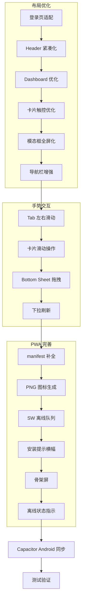

# TodoList 移动端全面适配方案

## 一、现状分析

### 已有的移动端基础
- ✅ Tailwind CSS 响应式断点 `md:` (768px)
- ✅ 移动端 Tab 切换（待办/进行中/已完成）
- ✅ 移动端底部导航栏（模版/设置/主题/登出）
- ✅ 详情面板 Bottom Sheet 模式
- ✅ Safe Area 支持（`env(safe-area-inset-*)`)
- ✅ `viewport-fit=cover` 元标签
- ✅ Capacitor Android 项目已初始化
- ✅ 基础 Service Worker 缓存

### 存在的问题
1. **布局问题**：模态框在小屏上不够全屏化，部分元素间距过紧
2. **触控体验**：缺少手势交互（滑动切换、下拉刷新、滑动操作）
3. **PWA 不完整**：缺少 PNG 图标、安装提示、离线队列、骨架屏
4. **视觉反馈**：底部导航缺少活跃高亮，无离线状态指示

---

## 二、改动方案

### 2.1 布局优化

#### 2.1.1 登录页移动端适配
**文件**: `apps/web/index.html` (`#auth-view` 区域)
- 增加 `min-h-screen` 确保全屏填充
- 调整 Logo 字号：移动端 `text-2xl`，桌面 `md:text-3xl`
- 输入框增加 `min-h-[48px]` 适配 iOS 键盘遮挡
- 添加 `padding-bottom: env(safe-area-inset-bottom)` 防止被虚拟键盘遮挡

#### 2.1.2 Header 移动端紧凑化
**文件**: `apps/web/index.html` (header 区域)
- 搜索框移动端：减小左右 padding，`min-h-[44px]` 已到位
- 移动端添加按钮：保持现有的 `min-h-[40px]`，增大到 `min-h-[44px]`

#### 2.1.3 仪表盘移动端优化
**文件**: `apps/web/index.html` (`#dashboard` 区域)
- 移动端环形图缩小至 `40x40`
- 统计卡片：移动端 `grid-cols-3` 已到位，优化内部间距
- 进度条移动端高度保持 `h-1.5`

#### 2.1.4 任务卡片触控优化
**文件**: `apps/web/index.html` (card template) + `apps/web/app.js`
- 卡片内部 padding 移动端增大：`p-4` (从 `p-3.5`)
- 优先级标签点击区域增大：`min-h-[28px] min-w-[48px]`
- 为卡片添加 `active:scale-[0.98]` 触摸按压反馈

#### 2.1.5 模态框移动端全屏化
**文件**: `apps/web/index.html` + `apps/web/app.js`
- 添加任务模态框：移动端改为底部弹出 Bottom Sheet 样式
  - `max-w-md` → 移动端 `w-full rounded-t-2xl rounded-b-none fixed bottom-0`
  - 添加顶部拖拽指示条
- 场景模版模态框：同理改为全屏抽屉
- 设置模态框：移动端全屏化

#### 2.1.6 底部导航栏增强
**文件**: `apps/web/index.html` (`#mobile-navbar`)
- 当前选中项增加高亮颜色（`text-indigo-600`）
- 增加一个"首页"导航项，表示任务列表
- 考虑 4 栏布局：首页 | 模版 | 设置 | 主题

---

### 2.2 手势交互

#### 2.2.1 左右滑动切换 Tab
**文件**: `apps/web/app.js` (新增 `TouchSwipe` 模块)

```
实现思路：
1. 监听 main 区域的 touchstart/touchmove/touchend 事件
2. 计算水平滑动距离，阈值 50px
3. 左滑 → 下一个 Tab，右滑 → 上一个 Tab
4. 切换时更新 mobileActive 并调用 updateMobileView()
5. 仅在移动端 < 768px 时启用
```

#### 2.2.2 任务卡片滑动操作
**文件**: `apps/web/app.js` (新增滑动操作逻辑) + `apps/web/index.html` (卡片模板)

```
实现思路：
1. 卡片外层包裹滑动容器
2. 右滑露出绿色「完成」按钮
3. 左滑露出红色「删除」按钮
4. 滑动超过阈值自动触发操作
5. 使用 CSS transform 实现平滑动画
6. 仅在移动端启用
```

#### 2.2.3 详情面板下拉手势关闭
**文件**: `apps/web/app.js` (`openDetailPanel`/`closeDetailPanel` 区域)

```
实现思路：
1. 监听 detail-drawer 的拖拽指示条区域的 touch 事件
2. 下拉距离 > 100px 时关闭面板
3. 下拉过程中实时更新 translateY
4. 松手后判断是否超过阈值：超过则关闭，否则弹回
5. 使用 CSS transition 实现弹性动画
```

#### 2.2.4 下拉刷新
**文件**: `apps/web/app.js` + `apps/web/index.html`

```
实现思路：
1. 在 app-view 顶部添加下拉刷新指示器元素
2. 监听页面滚动到顶部时的 touchmove 事件
3. 下拉超过 60px 显示刷新动画
4. 松手后触发数据重新加载（fetchTodos）
5. 加载完成后隐藏指示器
6. 使用 overscroll-behavior: contain 防止浏览器默认行为
```

---

### 2.3 PWA 完善

#### 2.3.1 补全 manifest.json
**文件**: `apps/web/manifest.json`

```json
增加字段：
- description: 简洁高效的待办任务管理工具
- categories: [productivity, utilities]
- orientation: portrait-primary
- shortcuts: [添加任务快捷方式]
- screenshots: [移动端截图 - 可选]
- id: /?source=pwa
```

#### 2.3.2 生成 PNG 图标
**文件**: `apps/web/icons/`
- 基于现有 `icon.svg` 生成 `icon-192.png` 和 `icon-512.png`
- 增加 `icon-maskable-192.png` 和 `icon-maskable-512.png`（自适应图标）
- manifest 中添加 `purpose: "maskable"` 图标项

#### 2.3.3 增强 Service Worker
**文件**: `apps/web/sw.js`

```
增强策略：
1. CDN 资源缓存（tailwindcss CDN）
2. API 请求离线队列：
   - POST/PUT/DELETE 请求在离线时存入 IndexedDB
   - 恢复在线后自动重放
3. 添加后台同步（Background Sync API）
4. 版本更新提示：检测到新版本时通知用户刷新
```

#### 2.3.4 PWA 安装提示横幅
**文件**: `apps/web/app.js` + `apps/web/index.html`

```
实现思路：
1. 监听 beforeinstallprompt 事件
2. 首次打开时在底部显示安装提示横幅
3. 用户点击安装后调用 prompt()
4. 安装后隐藏横幅
5. 用户关闭后 7 天内不再显示（localStorage 记录）
```

#### 2.3.5 骨架屏/启动画面
**文件**: `apps/web/index.html`

```
实现思路：
1. 在 #app-view 加载前显示骨架屏
2. 骨架屏模拟 header + dashboard + 卡片列表的灰色占位块
3. 数据加载完成后淡出骨架屏
4. 使用 CSS animation 实现微光效果
```

#### 2.3.6 离线状态指示器
**文件**: `apps/web/app.js` + `apps/web/index.html`

```
实现思路：
1. 监听 navigator.onLine 和 online/offline 事件
2. 离线时在 header 下方显示黄色横幅："当前处于离线模式"
3. 恢复在线时显示绿色横幅："已恢复连接"，3秒后自动消失
4. 离线时底部导航增加离线标识
```

---

## 三、架构流程图



## 四、文件影响范围

| 文件 | 改动类型 | 说明 |
|------|----------|------|
| `apps/web/index.html` | 修改 | 布局类名调整、新增骨架屏、安装横幅、离线指示器、卡片模板滑动容器 |
| `apps/web/app.js` | 修改 | 手势交互模块、下拉刷新、安装提示、离线指示、骨架屏控制 |
| `apps/web/sw.js` | 修改 | 离线队列、CDN 缓存、版本更新通知 |
| `apps/web/manifest.json` | 修改 | 补全 PWA 字段 |
| `apps/web/icons/` | 新增 | PNG 图标文件 |
| `android/` | 同步 | 更新 Capacitor web 资源 |

## 五、实施优先级

1. **P0 - 核心体验**：布局优化（卡片、模态框、导航栏）+ 骨架屏
2. **P1 - 交互增强**：Tab 滑动切换 + 详情面板拖拽关闭 + 下拉刷新
3. **P2 - PWA 能力**：manifest 补全 + 图标 + 安装提示 + 离线指示
4. **P3 - 高级特性**：卡片滑动操作 + SW 离线队列 + Capacitor 同步
